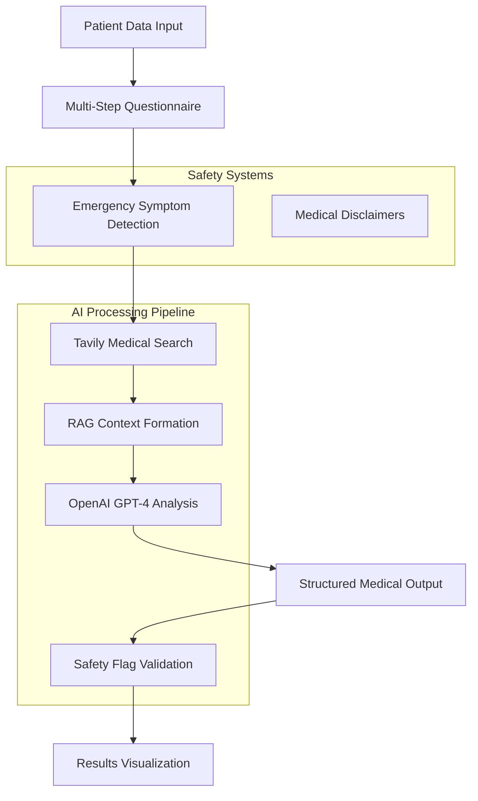

# Medical RAG Assistant - AI-Powered Clinical Decision Support System

[](https://nextjs.org/)
[](https://www.typescriptlang.org/)
[](https://openai.com/)
[](https://tavily.com/)
[](LICENSE)

A sophisticated **Retrieval-Augmented Generation (RAG)** medical assessment platform that combines real-time medical research with AI-powered clinical reasoning. Built with Next.js 15, TypeScript, and advanced AI integrations for educational medical analysis.

## 🏥 System Architecture



## ⚠️ Critical Safety Notice

**FOR EDUCATIONAL PURPOSES ONLY** - This system is designed for medical education and research. It is **NOT** intended for:
- Clinical diagnosis or treatment decisions
- Patient care without qualified medical supervision
- Emergency medical situations
- Replacing professional medical judgment

Always consult qualified healthcare providers for medical concerns.

## 🚀 Core Features & Technical Implementation

### 1. **RAG-Enhanced Medical Analysis**
- **Real-time medical research** via Tavily API integration
- **Domain-specific search** targeting medical databases (PubMed, Mayo Clinic, UpToDate, BMJ, NEJM)
- **Context-aware prompt engineering** for clinical reasoning
- **Evidence-based recommendations** with source attribution

### 2. **Advanced AI Pipeline**
- **OpenAI GPT-4** with structured function calling
- **Exponential backoff retry logic** for API resilience  
- **Temperature-controlled output** (0.3) for consistent medical reasoning
- **JSON schema validation** for structured medical data

### 3. **Safety-First Architecture**
- **Emergency symptom detection** with automatic escalation
- **Comprehensive safety flags** and medical disclaimers
- **Input validation** and sanitization
- **No PHI persistence** - client-side data handling only

### 4. **Modern Full-Stack Implementation**
- **Next.js 15** with App Router and Turbopack
- **TypeScript** for type-safe medical data structures
- **Server-side API routes** with proper error handling
- **Responsive UI** with Tailwind CSS 4 and daisyUI

## 📋 Technical Stack

### Frontend Architecture
```typescript
- Framework: Next.js 15.4.5 (App Router)
- Language: TypeScript 5.0
- Styling: Tailwind CSS 4.0 + daisyUI 5.0.50
- State Management: Zustand 5.0.7
- Animations: Framer Motion 12.23.12
- Data Fetching: TanStack Query 5.84.0
- Charts: Recharts 3.1.0
- PDF Generation: jsPDF 3.0.1
```

### Backend & AI Services
```typescript
- Runtime: Node.js with Next.js API Routes
- AI Provider: OpenAI 5.11.0 (GPT-4)
- Search Provider: Tavily Search API
- LangChain: 0.3.30 (optional chain implementations)
- Validation: TypeScript interfaces + runtime validation
```

### Development Tools
```typescript
- Linting: ESLint 9 with Next.js config
- Type Checking: TypeScript strict mode
- Build: Next.js + Turbopack
- Package Manager: npm
```

## 🔧 Installation & Development

### Prerequisites
- **Node.js** 18+ 
- **npm** or **yarn**
- **OpenAI API Key** (GPT-4 access required)
- **Tavily Search API Key**

### Quick Start

1. **Clone and install dependencies:**
```bash
git clone https://github.com/skkuhg/medical-rag-assistant.git
cd medical-rag-assistant
npm install
```

2. **Environment configuration:**
```bash
cp .env.example .env.local
```

Configure your `.env.local`:
```env
# OpenAI Configuration
OPENAI_API_KEY=sk-proj-your-openai-key-here

# Tavily Search Configuration  
TAVILY_API_KEY=tvly-your-tavily-key-here
```

3. **Development server:**
```bash
npm run dev
# Access: http://localhost:3000
```

4. **Production build:**
```bash
npm run build
npm start
```

## 🔌 API Documentation

### POST `/api/diagnose`

**Request Schema:**
```typescript
interface PatientData {
  age: number;
  sex: 'male' | 'female' | 'other';
  pregnancyStatus?: 'yes' | 'no' | 'possible';
  chiefComplaint: string;
  symptoms: string[];
  duration: string;
  severity: 1 | 2 | 3 | 4 | 5;
  medications: string[];
  allergies: string[];
}
```

**Response Schema:**
```typescript
interface DiagnosisResult {
  probable_conditions: string[];
  recommended_tests: string[];
  rx: Prescription[];
  safety_flags: string;
  sources: string[];
}

interface Prescription {
  drug: string;
  dosage: string;
  frequency: string;
  duration: string;
  notes: string;
}
```

### Example API Call

```bash
curl -X POST http://localhost:3000/api/diagnose \
  -H "Content-Type: application/json" \
  -d '{
    "age": 35,
    "sex": "female",
    "chiefComplaint": "persistent headache with nausea",
    "symptoms": ["headache", "nausea", "photophobia", "fatigue"],
    "duration": "3-days",
    "severity": 4,
    "medications": ["ibuprofen"],
    "allergies": ["penicillin"]
  }'
```

**Response:**
```json
{
  "probable_conditions": [
    "Migraine with aura",
    "Tension-type headache", 
    "Medication overuse headache"
  ],
  "recommended_tests": [
    "Neurological examination",
    "Blood pressure monitoring",
    "Consider MRI if red flags present"
  ],
  "rx": [
    {
      "drug": "Sumatriptan",
      "dosage": "50mg",
      "frequency": "as needed",
      "duration": "for acute episodes",
      "notes": "Take at onset of symptoms"
    }
  ],
  "safety_flags": "Monitor for medication overuse. This assessment is for educational purposes only.",
  "sources": [
    "https://pubmed.ncbi.nlm.nih.gov/...",
    "https://www.mayoclinic.org/..."
  ]
}
```

## 🔒 Security & Privacy Implementation

### Data Protection
- **No server-side PHI storage** - all patient data processed in memory only
- **API key protection** via environment variables
- **Input sanitization** and validation on all endpoints
- **CORS configuration** for development environments

### Error Handling
```typescript
- API rate limiting with exponential backoff
- Graceful degradation when services unavailable  
- Comprehensive error logging without PHI exposure
- User-friendly error messages with technical details hidden
```

### Safety Systems
```typescript
// Emergency symptom detection
const emergencySymptoms = [
  'chest pain', 'difficulty breathing', 'shortness of breath',
  'severe allergic reaction', 'anaphylaxis', 'loss of consciousness',
  'severe head injury', 'stroke symptoms', 'heart attack'
];

// Automatic safety flag enforcement
if (hasEmergencySymptoms) {
  diagnosis.safety_flags = "CALL EMERGENCY SERVICES IMMEDIATELY";
}
```

## 🚀 Deployment Options

### Vercel (Recommended)
```bash
npm run build
npx vercel --prod
```

### Docker Deployment
```dockerfile
FROM node:18-alpine
WORKDIR /app
COPY package*.json ./
RUN npm ci --only=production
COPY . .
RUN npm run build
EXPOSE 3000
CMD ["npm", "start"]
```

### Environment Variables for Production
```env
OPENAI_API_KEY=your-production-openai-key
TAVILY_API_KEY=your-production-tavily-key
NEXTAUTH_SECRET=your-secret-key
NEXTAUTH_URL=https://your-domain.com
```

## 🧪 Testing & Quality Assurance

### Development Scripts
```bash
npm run dev          # Development server with Turbopack
npm run build        # Production build
npm run start        # Production server  
npm run lint         # ESLint code analysis
npm run type-check   # TypeScript validation
```

### Testing Strategies
- **Type safety** via TypeScript strict mode
- **API endpoint testing** with curl/Postman
- **Error boundary testing** for graceful failures
- **Medical data validation** testing

## 📊 Performance Optimizations

- **Next.js 15** with Turbopack for faster builds
- **Server-side rendering** for improved SEO
- **Code splitting** and lazy loading
- **Image optimization** via Next.js Image component
- **API response caching** strategies
- **Tailwind CSS purging** for minimal bundle size

## 🤝 Contributing Guidelines

1. **Fork** the repository
2. **Create** feature branch (`git checkout -b feature/amazing-feature`)
3. **Commit** changes (`git commit -m 'Add amazing feature'`)
4. **Push** branch (`git push origin feature/amazing-feature`)
5. **Open** Pull Request

### Code Standards
- **TypeScript strict mode** required
- **ESLint** compliance mandatory
- **Medical accuracy** verification needed
- **Safety-first** development approach

## 📚 Medical Data Sources

The system integrates with reputable medical databases:
- **PubMed** - biomedical literature
- **Mayo Clinic** - patient care guidelines  
- **UpToDate** - clinical decision support
- **BMJ** - peer-reviewed medical research
- **NEJM** - medical research and reviews
- **WHO/CDC** - public health guidelines

## 🔮 Roadmap & Future Enhancements

- [ ] **Multi-language support** for international medical terms
- [ ] **FHIR integration** for standardized health data exchange
- [ ] **Advanced analytics** dashboard for usage patterns
- [ ] **Mobile app** development (React Native)
- [ ] **Voice input** capabilities for accessibility
- [ ] **Integration** with electronic health records (EHRs)
- [ ] **Machine learning** model fine-tuning on medical literature

## 📄 License & Compliance

**Educational Use License** - This project is intended for educational and research purposes only. Commercial use in clinical settings requires additional validation, compliance with medical regulations (HIPAA, GDPR, FDA), and appropriate medical oversight.

## 🤖 Generated with Claude Code

**Co-Authored-By: Claude <noreply@anthropic.com>**

---

*For technical support, feature requests, or medical accuracy concerns, please open an issue on GitHub.*
